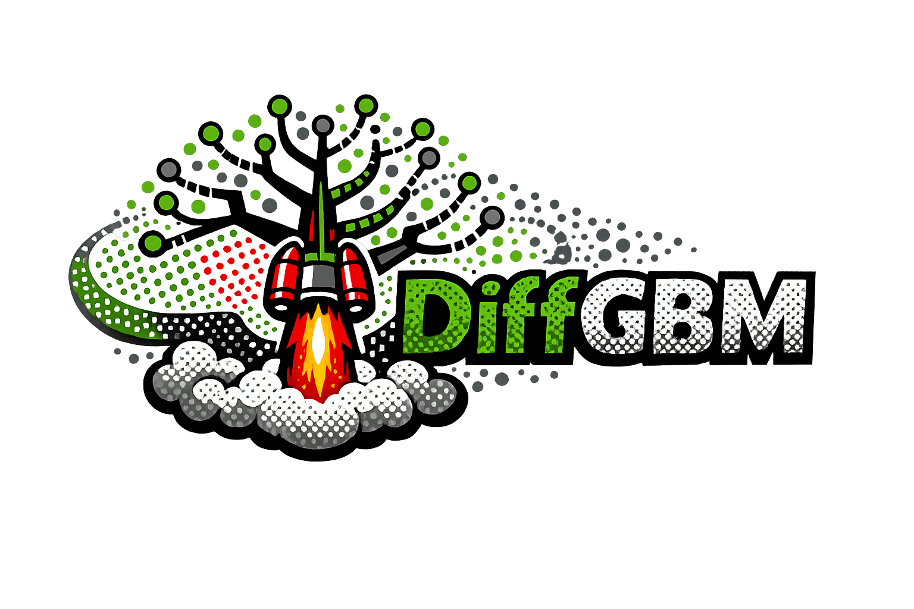
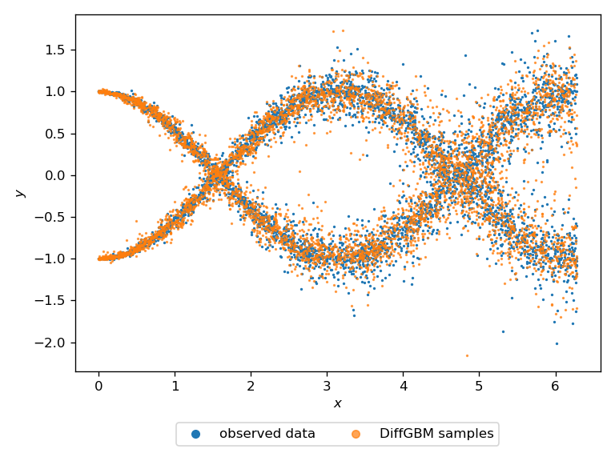

<p align="center">
  
</p>

# DiffGBM

[](https://pypi.org/project/diffgbm/)
[](https://pypi.org/project/diffgbm/)
[](https://opensource.org/licenses/MIT)
[](https://github.com/silaskoemen/diffgbm/actions/workflows/github-actions.yml)

**Probabilistic prediction on tabular data with gradient-boosted diffusion and flow-matching models.**

DiffGBM estimates the full conditional distribution `p(y|x)` — not just a point
prediction or a Gaussian interval. The distributions it learns can be
multimodal, heteroscedastic, skewed, or heavy-tailed, because nothing in the
model assumes a parametric predictive family. Training reduces to ordinary
LightGBM regression, so there is no neural density estimator to tune.

The API follows scikit-learn conventions and works with sensible defaults.

## Installation

```bash
pip install diffgbm
```

Development version:

```bash
pip install git+https://github.com/silaskoemen/diffgbm.git@main
```

## Quickstart

We generate a heteroscedastic response with two sinusoidal components and heavy tails.

```python
import matplotlib.pyplot as plt
import numpy as np
from diffgbm import DiffGBM, Samples

seed = 0
rng = np.random.default_rng(seed=seed)
n = 5000
x = rng.uniform(0, 2 * np.pi, size=n)
z = rng.integers(0, 2, size=n)
y = z * np.sin(x - np.pi / 2) + (1 - z) * np.cos(x) + rng.laplace(scale=x / 30, size=n)
```

Fit the model and draw samples:

```python
model = DiffGBM(seed=seed)
model.fit(x, y)

y_samples = model.sample(x, n_samples=1, seed=seed, verbose=True)
plt.scatter(x, y, s=1, label="observed data")
plt.scatter(x, y_samples[0, :], s=1, alpha=0.7, label="DiffGBM samples")
```



The samples recover both modes and the growing noise scale. Any downstream
quantity is then a Monte Carlo estimate:

```python
y_samples = model.sample(x, n_samples=100, verbose=True)  # leading axis is the 100 samples

y_mean = y_samples.mean(axis=0)
y_std = y_samples.std(axis=0)
```

The `Samples` helper wraps the common estimators:

```python
samples = Samples(y_samples)
samples.sample_mean()
samples.sample_std()
samples.sample_quantile(q=[0.05, 0.95])
```

## Two operating points

DiffGBM exposes the diffusion path, parameterization, training distribution,
features, and sampler as tunable choices rather than fixed defaults. Two
configurations are worth knowing about.

**Accuracy — score-side recipe (the default).** EDM preconditioning, an explicit
noise-level feature, log-sigma time sampling, and conditional-mean
residualization, sampled with the Euler SDE. In the paper these axes are tuned
jointly per dataset ("score-flex"); the defaults are the corner selected on most
datasets, so `DiffGBM()` needs no arguments to get here.

```python
model = DiffGBM(seed=seed)

# the same thing, written out
model = DiffGBM(
    score_parameterization="edm",
    noise_features="raw_time_log_std",
    t_sampling="log_sigma_normal",
    residualize="mean",
    seed=seed,
)
```

The published Treeffuser recipe is still reachable as an explicit configuration:

```python
model = DiffGBM(
    score_parameterization="noise",
    noise_features="raw_time",
    t_sampling="uniform",
    residualize="off",
    seed=seed,
)
```

**Speed and calibration — flow matching.** A directly learned velocity field on
a variance-preserving Gaussian path, sampled with a 5-step deterministic Heun
ODE. Roughly 5x cheaper sampling than the score path, with the tightest
interval coverage.

```python
model = DiffGBM(
    training_objective="flow_matching",
    flow_path="vp",
    seed=seed,
)
```

Flow matching builds its features from the path itself, so it always uses the
raw-time feature layout and ignores the score-only knobs
(`score_parameterization`, `noise_features`); it warns if you set them.

Categorical features are handled natively — set the column dtype to `category`
in a pandas DataFrame and LightGBM's categorical splits are used directly.

## Results

Across eleven benchmarks (ten UCI regression tasks plus CT-slice localization),
with fold-0 tuning, folds-1–5 evaluation, and an equalized 40-trial budget:

| Variant | CRPSS ↑ | rel-CRPS ↓ | \|cE\|@90 ↓ | sample (s) ↓ |
|---|---|---|---|---|
| Treeffuser (published) | 0.699 | 1.248 | 0.047 | 182.7 |
| **DiffGBM score-flex** | **0.725** | **1.106** | 0.049 | 296.1 |
| **DiffGBM flow matching** | 0.707 | 1.334 | **0.029** | **35.5** |

Score-flex beats the published baseline on **every one of the eleven datasets**
(paired Wilcoxon 11/0, one-sided *p* = 4.9 × 10⁻⁴), and a DiffGBM row is the
per-dataset raw-CRPS winner on 9 of 11.

The two rows are genuinely different operating points rather than one dominating
the other. Score-flex buys aggregate accuracy with a stochastic sampler, so it is
the slowest row and its interval coverage is no better than the baseline's. Flow
matching gives up aggregate CRPS to become the cheapest sampler and the
best-calibrated row. Tuned non-diffusion baselines still win individual datasets;
see the paper for the full comparison and its caveats.

## Documentation

Parameters are documented in the `DiffGBM` docstring:

```python
from diffgbm import DiffGBM
help(DiffGBM)
```

Worked examples live in [`examples/`](examples/). The research harness that
produced the paper's numbers is in [`benchmarks/`](benchmarks/), driven by YAML
configs under `benchmarks/configs/`.

## FAQ

**Sampling is slow.** Reduce `n_estimators` or `early_stopping_rounds` first.
If you need a large speedup, switch to the flow-matching configuration above —
it samples in five ODE steps instead of fifty SDE steps.

## Citing

If you use DiffGBM, please cite:

```bibtex
@article{koemen2026diffgbm,
  title={Conditioning Tree-Based Diffusions and Flows for Probabilistic Tabular Regression},
  author={Silas Koemen},
  year={2026},
}
```

DiffGBM builds on Treeffuser, which should be cited alongside it:

```bibtex
@article{beltranvelez2024treeffuser,
  title={Treeffuser: Probabilistic Predictions via Conditional Diffusions with Gradient-Boosted Trees},
  author={Nicolas Beltran-Velez and Alessandro Antonio Grande and Achille Nazaret and Alp Kucukelbir and David Blei},
  year={2024},
  eprint={2406.07658},
  archivePrefix={arXiv},
  primaryClass={cs.LG},
  url={https://arxiv.org/abs/2406.07658},
}
```

## Acknowledgements

DiffGBM is a derivative of [Treeffuser](https://github.com/blei-lab/treeffuser)
by Nicolas Beltran-Velez, Alessandro Antonio Grande, and Achille Nazaret, and
retains its gradient-boosted-tree backbone, SDE module, and feature pipeline
under the MIT license. See [NOTICE](NOTICE) for full attribution.

## License

MIT — see [LICENSE](LICENSE).
